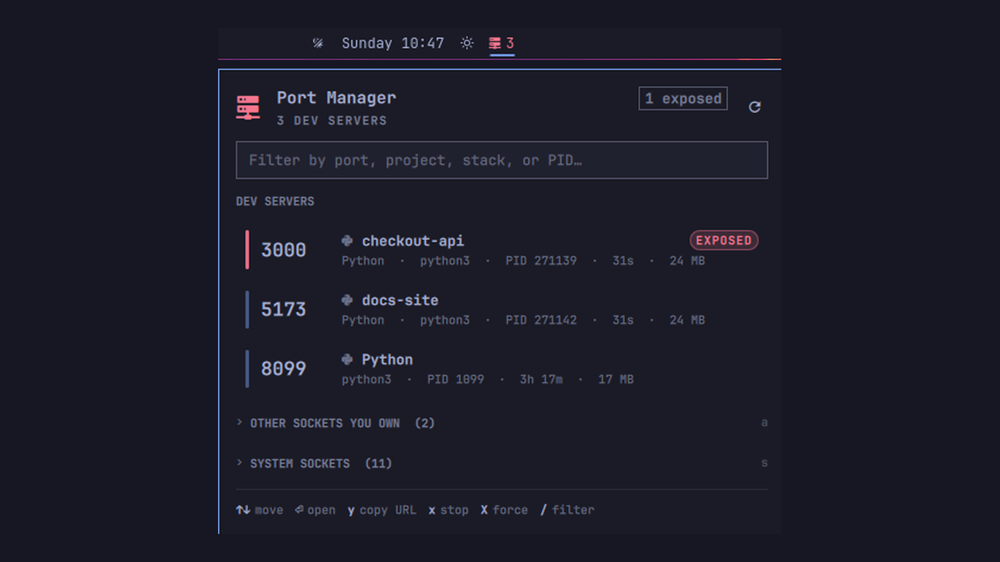

# Port Manager

Every port listening on this machine, named by the project that holds it.



One bar icon shows how many dev servers are up. Click it and the panel answers
the three questions you actually have, in that order: **what is running**, **is
it reachable from outside this machine**, and **how do I stop it**.

```
󰒍 2
┌──────────────────────────────────────────────────┐
│ 󰒍  Port Manager                     [1 exposed]  │
│    2 DEV SERVERS                             ↻   │
│  ┌────────────────────────────────────────────┐  │
│  │ Filter by port, project, stack, or PID…    │  │
│  └────────────────────────────────────────────┘  │
│  DEV SERVERS                                     │
│  ▌5173    fakeproj                  (EXPOSED)    │
│           Python · python3 · PID 239145 · 5m     │
│  ▌8099    checkout-api                           │
│           Node · node · PID 1099 · 3h 4m · 78 MB │
│  ⌄ OTHER SOCKETS YOU OWN  (2)                a   │
│  ⌄ SYSTEM SOCKETS  (11)                      s   │
│  ↑↓ move  ⏎ open  y copy URL  x stop  X force    │
└──────────────────────────────────────────────────┘
```

## What it does

- **Names the port by its project.** The owning process's working directory is
  walked up to the nearest git checkout, so port 5173 reads `checkout-api`, not
  `node`. This is the thing you actually wanted to know.
- **Detects the stack.** Vite, Next.js, Django, Rails, Go, Rust, Docker,
  Postgres, and the rest get a glyph and a label from the command line.
- **Flags what is exposed.** A socket bound to `0.0.0.0` is reachable from your
  network; one bound to `127.0.0.1` is not. Exposed rows get a red rail, a
  pill, and a count in the bar icon's tooltip.
- **Keeps the noise out of the way.** Dev servers lead. Your ephemeral sockets
  and the system's collapse into two sections you open with `a` and `s`.
  Nothing is hidden — it is just not first.
- **Names system ports it cannot inspect.** `ss` will not tell a normal user
  which process owns port 53, so the panel says "DNS" rather than "unknown".
- **Stops things safely.** Only processes your own user owns can be signalled,
  never PID 1, and every stop is armed before it fires.

## Keys

| Key | Action |
|-----|--------|
| `↑` `↓` / `j` `k` | Move the cursor |
| `⏎` / `o` | Open `http://localhost:<port>` |
| `y` | Copy the URL |
| `c` | Copy the full command line |
| `e` | Open the project directory |
| `x` | Stop (SIGTERM) — press twice |
| `X` | Force kill (SIGKILL) — press twice |
| `a` / `s` | Expand your other sockets / system sockets |
| `/` or any digit | Jump to the filter |
| `r` | Refresh |
| `Esc` | Close |

Mouse works throughout: click a row to open it, middle-click to copy, and the
open / copy / stop buttons appear on the row under the cursor.

### Stopping is armed, not confirmed

The first `x` arms the row and starts a three-second bar that drains along its
bottom edge. The second `x` sends the signal. Move the cursor, or wait, and it
disarms. This is deliberately not a modal dialog: a dialog steals focus and
breaks the keyboard flow for the one action you are most likely to repeat.

After a SIGTERM the backend waits up to 1.5s to see whether the process
actually exited, so the panel reports what happened rather than guessing.

## Install

```bash
omarchy plugin add https://github.com/AdemBenAbdallah/omarchy-port-manager.git --enable --yes
```

That is the whole install. `omarchy plugin add` clones the repository, validates
the manifest, and shows you the code before anything is enabled; it runs no
install hook and requests no elevated privileges.

To install without the plugin manager, place the contents of this repository in
a directory named for the plugin id — `~/.config/omarchy/plugins/io.github.adembenabdallah.port-manager/`
— then run `omarchy-restart-shell` and
`omarchy plugin enable io.github.adembenabdallah.port-manager`.

> Changing a plugin's `entryPoints` requires `omarchy-restart-shell`, not just
> `rescanPlugins` — the bar caches the widget component by URL.

## Settings

Setup → Plugins → Port Manager, or inline in `~/.config/omarchy/shell.json`:

| Key | Default | Meaning |
|-----|---------|---------|
| `refreshIntervalSec` | `20` | Background refresh for the bar count. The open panel always polls every 2.5s. |
| `showCount` | `true` | Print the dev-server count next to the bar icon. |

## From the terminal

The panel is not the only way in. The backend is a standalone script, which is
what you want the moment a port conflict shows up in a shell rather than on
screen:

```bash
cd ~/.config/omarchy/plugins/io.github.adembenabdallah.port-manager

python3 port-manager.py                 # every listening socket, as JSON
python3 port-manager.py check 3000      # free? who holds it? next free port?
python3 port-manager.py kill-port 3000  # stop whatever holds it
python3 port-manager.py stop 12345      # stop by PID (--force for SIGKILL)
```

And over shell IPC:

```bash
omarchy-shell port-manager toggle
omarchy-shell port-manager refresh
omarchy-shell port-manager ports        # current rows as JSON
```

## Safety

- A process is only signalled when `/proc/<pid>` is owned by your uid.
- PID 1 and below are refused outright.
- Everything runs as your own user. No privilege escalation, no network access.
- The only external command is `ss -H -ltnup` from `iproute2`; everything else
  is a read from `/proc`.

## Requirements

Omarchy Quattro (shell plugin API v1), `iproute2` for `ss`, `wl-clipboard` for
copy, and `xdg-utils` for open. Python 3.8+.

## Layout

| File | Role |
|------|------|
| `manifest.json` | Plugin identity, entry point, settings schema |
| `Panel.qml` | Bar widget and panel — the only entry point |
| `Model.js` | Filtering, grouping, and string shaping |
| `port-manager.py` | Socket enumeration and process control |

## License

MIT
